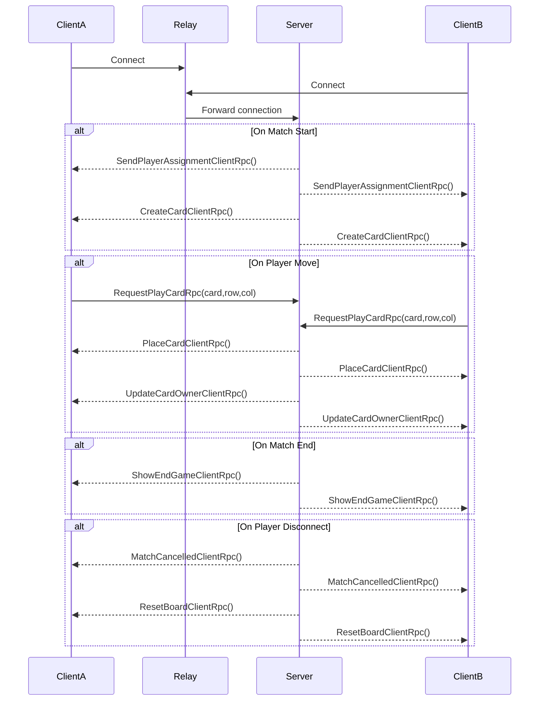

# Relatório Projeto Final - Sistemas de Redes para Jogos
## Bernardo Barros a22401588

### Tema escolhido:

Implementar um jogo online baseado em turnos, cliente/servidor, sem login/matchmaking

## Introdução

No âmbito da cadeira de Sistemas de Redes para Jogos, foi nos proposto a elaboração de um projeto para implementação de um jogo online em Unity.

Neste sentido, o projeto elaborado foi a criação de um jogo de cartas baseado no minijogo de cartas Triple Triad do jogo eletrónico Final Fantasy 8.

O conceito deste jogo é, que dois jogadores, cada um com 5 cartas com indicação do seu dono, jogam num tabuleiro 3x3 colocando cartas à vez. As cartas têm números que representam cada um dos lados da carta. Quando uma carta é colocada ao lado de outra, os valores dos lados adjacentes são comparados e se a carta colocada ter valor maior à carta já no tabuleiro, o dono desta carta será alterado para o dono da carta colocada.
O jogo acaba quando o tabuleiro todo  é preenchido e o vencedor decido pelo jogador com maior número de cartas.

O resultado pretendido é ter o jogo a funcionar nestes modos com suporte para multijogador numa estrutura cliente/servidor.

## Implementação

Antes de implementar o jogo para multiplayer, foi feito uma versão em single player de modo a assegurar que em termos de lógica e UI, o jogo estava a funcionar corretamente.

Os scripts Board, Card e PlayerHand, foram feitos para tratar dos dados do jogo (valores das cartas, posições do tabuleiro, que cartas estão nas mãos dos jogadores). Os scripts BoardCellUI e CardUI tratam do input e output para os jogadores, permitindo que estes possam ver as cartas em jogo, as posições do tabuleiro e interação com estes elementos. O GameManager é responsável pelo flow do jogo, fazendo a ligação entre os dados e o UI. Para implementar o multiplayer, o GameManager foi alterado para incluir o Netcode necessário (Rpcs).

Para permitir a comunicação entre servidor e clientes, foi usado o sistema de Relay Servers do Unity.

Também para a parte do multiplayer foram adicionados os scripts ClientJoinUI, NetworkStartup e RelayManager para permitir as ligações de clientes às salas de jogo por via de introdução de código, a determinação de se uma instância do jogo é Servidor ou Cliente e a ativação do Relay Server do Unity para criar a sala de jogo e a atribuição de um código de ligação ao servidor respetivamente

Na implementação de servidor/cliente, o servidor é responsável pela manutenção do estado do jogo, a geração das cartas e a sua distribuição pelos jogadores(clientes), a determinação de turnos e do vencedor.
O cliente por sua vez só faz pedidos ao servidor sobre a posição em que irá colocar uma carta e qual a carta a usar.
O servidor confirma se é a vez do jogador, se a carta é sua e se a posição está disponível ou se é válida.

Tudo o que foi referido anteriormente foi feito através do uso de Rpcs, com os clientes a terem um único Rpc "RequestPlayCardRpc" em que os clientes enviam ao servidor o ID da carta que querem usar e a posição a colocar (é dado o valor da linha e o da coluna). Estes dados são depois validados pelo servidor para assegurar que a jogada é válida e se for é depois feita nos dados Servidor.

O Servidor, através do "PlaceCardClientRpc", irá depois informar os clientes para atualizarem os seus UIs com a nova posição da carta jogada.

O Servidor, ao fazer a jogada também irá verificar se a carta jogada irá conseguir capturar alguma carta em que está ao lado (através da lógica definida na class Board) e fazer as devidas alterações nos seus dados. Aos clientes, comunica qualquer alteração de dono através do "UpdateCardOwnerClientRpc" que avisa os clientes da carta (ou cartas) cujo dono foi alterado e para fazer as devidas alterações no UI.

No final do jogo, o Servidor verifica quantas cartas cada jogador tem de modo a determinar o vencedor ou se ocorreu um empate, avisando os Clientes através do "ShowEndGameClientRpc" em que o texto que indica os turnos é alterado para mostrar o resultado do jogo.

Quando um jogador entra numa sala de jogo, o servidor irá comunicar se é o jogador Azul ou Vermelho através do "SendPlayerAssignmentClientRpc" onde a variável LocalPlayer do cliente é alterada para que seja depois utilizada em comparação com a NetworkVariable CurrentVariable conforme adequado.

O Servidor atribui as cartas aos jogadores através do "CreateCardClientRpc", com o servidor a gerar as cartas e distribui aos jogadores como elementos de UI. Apenas o Servidor é que gera cartas, as distribuídas irão para as mãos (PlayerHand) de cada jogador.

No caso de um jogador sair da sala, o restante jogador irá voltar ao estado inicial em que o texto de turno diz apenas "Waiting for other player..." através do "MatchCanceledClientRpc" e um reset é feito ao estado do jogo através do "ResetBoardClientRpc".

Usando as ferramentas de visualização do Unity, uma partida de início ao fim gerou os seguintes dados:

- O tráfico enviado ou recebido não excedeu os 400b/s
- Não houve mais de 20 pacotes a serem enviados por segundo
- E as mensagens RPC enviadas manteram-se abaixo das 30 enviados por segundo

## Diagrama de Arquitetura de Redes

## Resultados

Através dos Rpcs, foi conseguido sincronização entre os clientes do estado do jogo, podendo uma partida ser jogada de inicío ao fim com a indicação do vencedor ou de um empate. Foi também conseguido que uma partida possa ser reiniciada numa sala no caso de um jogador se desconectar.
Ficou em falta dar mais feedback aos jogadores no caso de jogadas inválidas.

## Conclusão

A implementação bem sucedida do projeto deu para perceber que numa arquitetura cliente/servidor é importante determinar, no sentido de assegurar que não há possibilidade de batotas por parte dos clientes, que elementos devem estar no controlo do servidor e o que terá ser feito por pedido por parte dos clientes.

## Bibliografia

- slides de aula
- <https://www.youtube.com/watch?v=swIM2z6Foxk>
- <https://www.youtube.com/watch?v=3yuBOB3VrCk&t=327s>
- ChatGPT foi usado para correção de código
