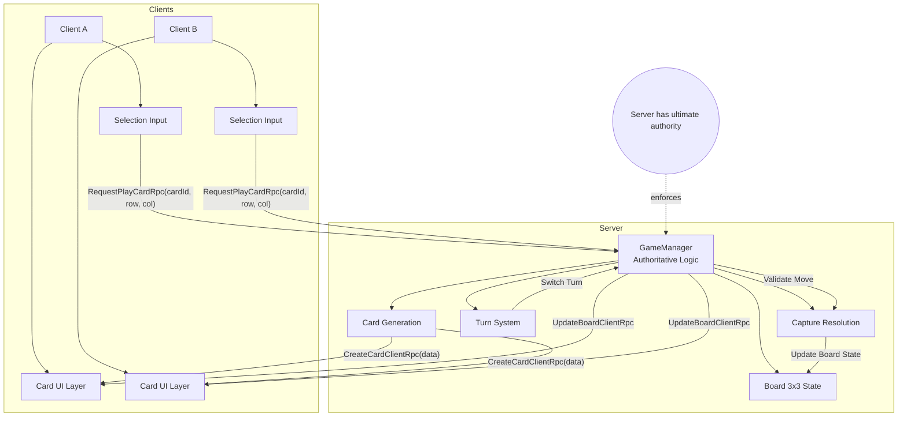

# Relatório Projeto Final - Sistemas de Redes para Jogos
## Bernardo Barros a22401588

### Tema escolhido:

Implementar um jogo online baseado em turnos, cliente/servidor, sem login/matchmaking

## Introdução

No âmbito da cadeira de Sistemas de Redes para Jogos, foi nos proposto a elaboração de um projeto para implementação de um jogo online em Unity.

Neste sentido, o projeto elaborado foi a criação de um jogo de cartas baseado no minijogo de cartas Triple Triad do jogo eletrónico Final Fantasy 8.

O conceito deste jogo é, que dois jogadores, cada um com 5 cartas com indicação do seu dono, jogam num tabuleiro 3x3 colocando cartas à vez. As cartas têm números que representam cada um dos lados da carta. Quando uma carta é colocada ao lado de outra, os valores dos lados adjacentes são comparados e se a carta colocada ter valor maior à carta já no tabuleiro, o dono desta carta será alterado para o dono da carta colocada.
O jogo acaba quando o tabuleiro todo  é preenchido e o vencedor decido pelo jogador com maior número de cartas.

O resultado pretendido é ter o jogo a funcionar nestes modos com suporte para multijogador numa estrutura cliente/servidor.

## Implementação

Na implementação de servidor/cliente, o servidor será responsável pela manutenção do estado do jogo, a geração das cartas e a sua distribuição pelos jogadores(clientes), a determinação de turnos e do vencedor.

O cliente por sua vez só poderá fazer pedidos ao servidor sobre a posição em que irá colocar uma carta e qual a carta a usar.

O servidor confirma se é a vez do jogador, se a carta é sua e se a posição está disponível.

## Diagrama de Arquitetura de Redes

## Resultados

Utilizando argumentos de linha de comando, foi possível ter executáveis do jogo a correr como Servidor e outros como Clientes.

Cada cliente é atribuido um valor de jogador (Azul ou Vermelho) com o primeiro jogador a ser atribuído o valor Azul.

Apenas o servidor é que gera as cartas sendo que apenas na janela do mesmo é que aparecem.

Não foi possível fazer a sincronização com os clientes para a atribuição das cartas por jogador.

O loop do jogo também está em falta bem como a determinação do vencedor.

## Conclusão

Embora a implementação deste projeto falhou, deu para perceber que numa arquitetura cliente/servidor é importante determinar, no sentido de assegurar que não há possibilidade de batotas por parte dos clientes, que elementos devem estar no controlo do servidor e o que terá ser feito por pedido por parte dos clientes.

## Bibliografia

- slides de aula
- https://www.youtube.com/watch?v=swIM2z6Foxk
- https://www.youtube.com/watch?v=3yuBOB3VrCk&t=327s
- ChatGPT foi usado para correção de código